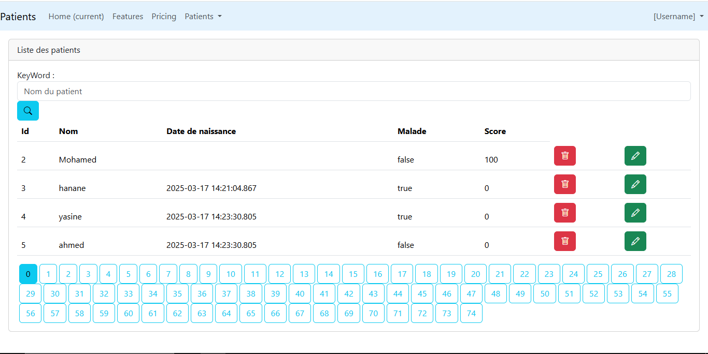
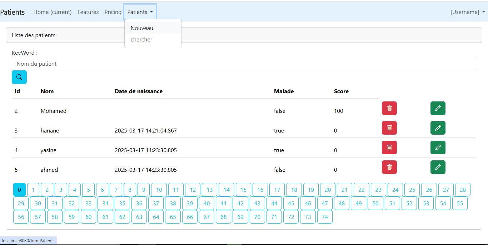
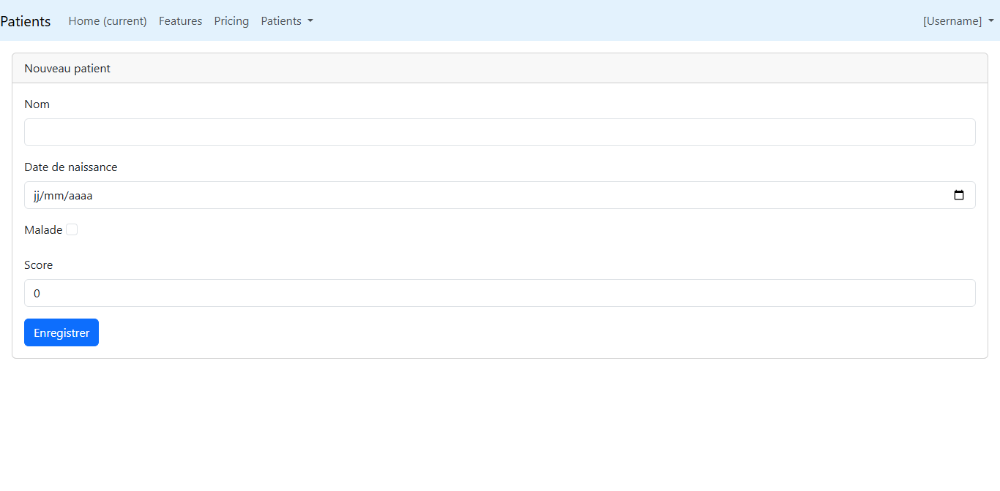
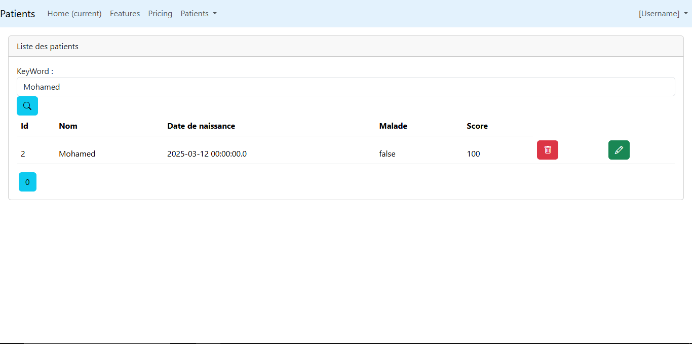
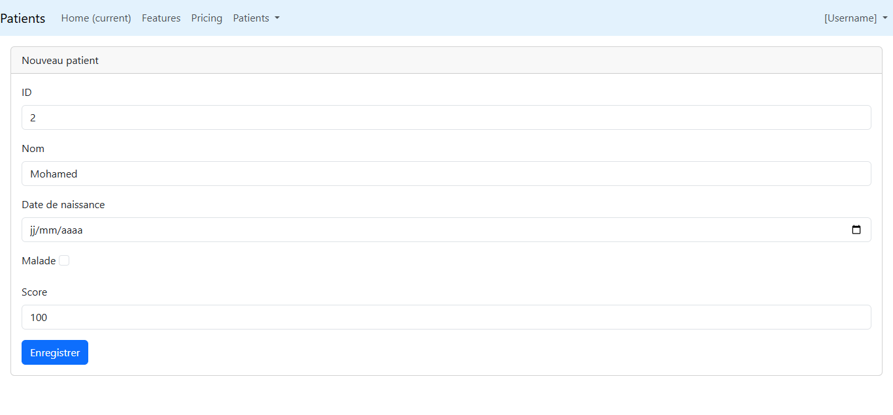
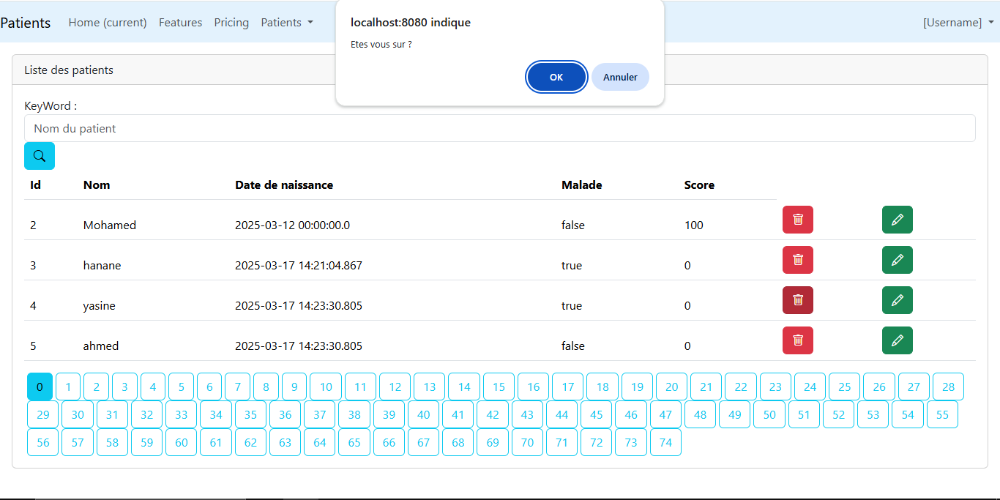

# TP3 : Système de Gestion des Patients

## Aperçu
Ce projet est une application web Spring Boot qui gère les informations des patients en utilisant l'architecture Spring MVC avec le moteur de templates Thymeleaf. L'application offre une interface CRUD complète (Création, Lecture, Mise à jour, Suppression) pour les dossiers patients avec fonctionnalités de pagination et de recherche.

## Fonctionnalités
- Affichage de la liste des patients avec pagination
- Recherche de patients par nom
- Ajout de nouveaux patients avec validation
- Modification des informations des patients existants
- Suppression de patients
- Interface utilisateur responsive utilisant Bootstrap 5

## Technologies Utilisées
- **Spring Boot 3.4.3** : Framework Java simplifiant le développement d'applications
- **Spring MVC** : Implémentation du modèle MVC pour la couche web
- **Spring Data JPA** : Facilite l'accès et la manipulation des données en base
- **MySQL** : Système de gestion de base de données (configurable pour utiliser H2 en mémoire)
- **Thymeleaf** : Moteur de templates côté serveur
- **Bootstrap 5.3.3** : Framework CSS pour les composants UI
- **Lombok** : Bibliothèque réduisant le code répétitif
- **Bean Validation** : API pour la validation des formulaires
- **Maven** : Outil de gestion de dépendances et de build
- **Java 17** : Version du langage utilisée

## Structure du Projet
```
src/main/java/ma/tp/tp3springmvcthymleaf/
├── entities/
│   └── Patient.java             # Entité Patient avec annotations de validation
├── repository/
│   └── PatientRepository.java   # Repository Spring Data JPA
├── web/
│   └── PatientController.java   # Contrôleur MVC avec mappings des requêtes
└── Tp3SpringMvcThymleafApplication.java  # Classe principale de l'application

src/main/resources/
├── application.properties       # Configuration de l'application
├── templates/
│   ├── editPatients.html        # Template du formulaire de modification
│   ├── formPatients.html        # Template du formulaire d'ajout
│   ├── patient.html             # Template de la vue liste des patients
│   └── template1.html           # Template de base pour l'héritage
```

## Détails d'Implémentation

### Entité Patient
L'entité `Patient` est définie avec les champs suivants:

```java
@Data @NoArgsConstructor
@AllArgsConstructor @Builder
@Entity
public class Patient {
    @Id @GeneratedValue(strategy = jakarta.persistence.GenerationType.IDENTITY)
    private Long id;
    
    @NotEmpty
    @Size(min = 5, max = 15)
    private String nom;
    
    @DateTimeFormat(pattern = "yyyy-MM-dd")
    private Date dateNaissance;
    
    private boolean malade;
    
    @DecimalMin("100")
    private int score;
}
```

Les annotations de validation garantissent:
- Le nom du patient ne peut pas être vide et doit contenir entre 5 et 15 caractères
- Le score doit être au minimum de 100
- La date de naissance est formatée selon le pattern "yyyy-MM-dd"

### Repository
Le `PatientRepository` étend `JpaRepository` et définit une méthode de recherche personnalisée:

```java
public interface PatientRepository extends JpaRepository<Patient, Long> {
    Page<Patient> findByNomContains(String keyword, Pageable pageable);
}
```

Cette méthode permet la recherche paginée des patients dont le nom contient le mot-clé spécifié.

### Contrôleur
Le `PatientController` gère toutes les opérations CRUD:

#### Affichage et recherche de patients
```java
@GetMapping("/index")
public String index(Model model,
                   @RequestParam(name ="page", defaultValue = "0") int p,
                   @RequestParam(name ="size", defaultValue = "4")  int s,
                   @RequestParam(name ="keyword", defaultValue = "") String kw) {
    Page<Patient> pagePatients = patientRepository.findByNomContains(kw, PageRequest.of(p, s));
    model.addAttribute("patients", pagePatients.getContent());
    model.addAttribute("pages", new int[pagePatients.getTotalPages()]);
    model.addAttribute("currentPage", p);
    model.addAttribute("keyword", kw);
    return "patient";
}
```

Cette méthode:
- Accepte des paramètres pour la pagination (page et taille) et la recherche (mot-clé)
- Récupère les patients correspondants depuis le repository
- Ajoute les données au modèle pour l'affichage
- Retourne la vue "patient"

#### Suppression d'un patient
```java
@GetMapping("/delete")
public String delete(Long id, String keyword, int page) {
    patientRepository.deleteById(id);
    return "redirect:/index?page="+page+"&keyword="+keyword;
}
```

Cette méthode supprime un patient et redirige vers la même page de la liste avec les mêmes paramètres de recherche.

#### Ajout d'un nouveau patient
```java
@GetMapping("/formPatients")
public String formPatient(Model model) {
    model.addAttribute("patient", new Patient());
    return "formPatients";
}
```

Cette méthode affiche le formulaire d'ajout d'un nouveau patient.

#### Modification d'un patient existant
```java
@GetMapping("/editPatients")
public String editPatients(Model model, Long id, String keyword, int page) {
    Patient patient = patientRepository.findById(id).orElse(null);
    if (patient == null) {throw new RuntimeException("Patient not found");}
    model.addAttribute("patient", patient);
    model.addAttribute("keyword", keyword);
    model.addAttribute("currentPage", page);
    return "editPatients";
}
```

Cette méthode:
- Récupère le patient à modifier par son ID
- Ajoute le patient au modèle
- Conserve le mot-clé de recherche et la page courante pour le retour
- Affiche le formulaire de modification

#### Enregistrement des données du patient
```java
@PostMapping("/save")
public String savePatient(Model model, @Valid Patient patient, BindingResult bandingResult,
                         @RequestParam(defaultValue = "") String keyword,
                         @RequestParam(defaultValue = "0") int page) {
    if (bandingResult.hasErrors()) return "formPatients";
    patientRepository.save(patient);
    return "redirect:/index?page="+page+"&keyword="+keyword;
}
```

Cette méthode:
- Valide les données du patient avec l'annotation `@Valid`
- Vérifie les erreurs de validation
- Enregistre le patient en base de données
- Redirige vers la liste des patients

### Configuration de la Base de Données
L'application est configurée pour utiliser MySQL par défaut mais peut être adaptée pour utiliser H2 en mémoire en décommentant les lignes appropriées dans `application.properties`.

**Configuration MySQL (Par défaut):**
```properties
spring.datasource.url=jdbc:mysql://localhost:3306/patientsdb?createDatabaseIfNotExist=true
spring.datasource.username=root
spring.datasource.password=root
spring.datasource.driver-class-name=com.mysql.cj.jdbc.Driver
spring.jpa.hibernate.ddl-auto=update
```

**Configuration H2 (À décommenter pour utiliser):**
```properties
# spring.h2.console.enabled=true
# spring.datasource.url=jdbc:h2:mem:patientdb
```

L'option `createDatabaseIfNotExist=true` permet de créer automatiquement la base de données si elle n'existe pas.

### Données d'Exemple
L'application est préchargée avec des données d'exemple lors du démarrage via la classe principale:

```java
@SpringBootApplication
public class Tp3SpringMvcThymleafApplication implements CommandLineRunner {
    @Autowired
    private PatientRepository patientRepository;
    
    @Override
    public void run(String... args) throws Exception {
        Patient patient = new Patient().builder().nom("yasine").dateNaissance(new Date()).malade(true).score(110).build();
        Patient patient1 = new Patient().builder().nom("ahmed").dateNaissance(new Date()).malade(false).score(120).build();
        Patient patient2 = new Patient().builder().nom("hanane").dateNaissance(new Date()).malade(true).score(130).build();
        patientRepository.save(patient);
        patientRepository.save(patient1);
        patientRepository.save(patient2);
    }
}
```

### Thymeleaf et Bootstrap
Les templates utilisent Thymeleaf pour le rendu côté serveur et Bootstrap pour la mise en page:

#### Template de Base (template1.html)
```html
<!DOCTYPE html>
<html xmlns:th="http://www.thymeleaf.org"
      xmlns:layout="http://www.ultraq.net.nz/thymeleaf/layout">
<head>
    <!-- En-têtes et liens CSS/JS -->
</head>
<body>
    <!-- Barre de navigation -->
    <section layout:fragment="content1"></section>
</body>
</html>
```

Ce template définit la structure commune à toutes les pages avec:
- Une barre de navigation
- Un emplacement pour le contenu spécifique à chaque page

#### Liste des Patients (patient.html)
```html
<div layout:fragment="content1">
    <!-- Formulaire de recherche -->
    <!-- Tableau des patients -->
    <!-- Pagination -->
</div>
```

Cette vue:
- Hérite du template de base
- Affiche un formulaire de recherche
- Présente les patients dans un tableau
- Offre des contrôles de pagination

### Pagination
La pagination est implémentée à deux niveaux:

1. **Côté Serveur**: Via `PageRequest.of(p, s)` dans le contrôleur
2. **Côté Client**: Via des boutons générés dynamiquement dans la vue

```html
<ul class="nav nav-pills">
    <li th:each="page,status:${pages}">
        <a th:href="@{/index(page=${status.index},keyword=${keyword})}"
           th:text="${status.index}"
           th:class="${status.index == currentPage ? 'btn btn-info ms-1' : 'btn btn-outline-info ms-1'}">
        </a>
    </li>
</ul>
```

### Validation des Formulaires
La validation est gérée par Bean Validation avec affichage des erreurs dans les templates:

```html
<div class="mb-3">
    <label for="nom" class="form-label">Nom</label>
    <input type="text" class="form-control" id="nom" name="nom" th:value="${patient.nom}">
    <span th:errors="${patient.nom}" class="text-danger"></span>
</div>
```

## Exécution de l'Application
1. Assurez-vous d'avoir Java 17 et Maven installés
2. Configurez votre base de données dans `application.properties`
3. Construisez le projet: `mvn clean install`
4. Exécutez l'application: `mvn spring-boot:run`
5. Accédez à l'application: http://localhost:8080/index

## Captures d'écran
### index


### Ajout de Patient

### Recherche d'un Patient

### Modification d'un Patient

### Suppression d'un Patient



## Améliorations Futures
- Authentification et autorisation des utilisateurs
- Attributs supplémentaires pour les patients (adresse, coordonnées)
- Suivi des antécédents médicaux
- Planification des rendez-vous
- Fonctionnalité d'exportation vers PDF/Excel
- Interface multilingue
- Tableau de bord avec statistiques
- API REST pour intégration mobile

## Dépendances Maven Principales
Le projet utilise plusieurs dépendances clés:

```xml
<dependencies>
    <!-- Spring Boot Starter pour JPA -->
    <dependency>
        <groupId>org.springframework.boot</groupId>
        <artifactId>spring-boot-starter-data-jpa</artifactId>
    </dependency>
    
    <!-- Thymeleaf pour les templates -->
    <dependency>
        <groupId>org.springframework.boot</groupId>
        <artifactId>spring-boot-starter-thymeleaf</artifactId>
    </dependency>
    
    <!-- Spring Boot Starter pour Web -->
    <dependency>
        <groupId>org.springframework.boot</groupId>
        <artifactId>spring-boot-starter-web</artifactId>
    </dependency>
    
    <!-- MySQL Connector -->
    <dependency>
        <groupId>com.mysql</groupId>
        <artifactId>mysql-connector-j</artifactId>
        <scope>runtime</scope>
    </dependency>
    
    <!-- Bootstrap pour l'UI -->
    <dependency>
        <groupId>org.webjars</groupId>
        <artifactId>bootstrap</artifactId>
        <version>5.3.3</version>
    </dependency>
    
    <!-- Validation -->
    <dependency>
        <groupId>org.springframework.boot</groupId>
        <artifactId>spring-boot-starter-validation</artifactId>
    </dependency>
</dependencies>
```

## Conclusion
Ce projet démontre une implémentation complète d'une application web CRUD basée sur Spring MVC et Thymeleaf. Il intègre les bonnes pratiques de développement avec Spring Boot, incluant la séparation des couches, la validation des données, et une interface utilisateur responsive. Cette application peut servir de base pour le développement de systèmes plus complexes de gestion dans le domaine médical.